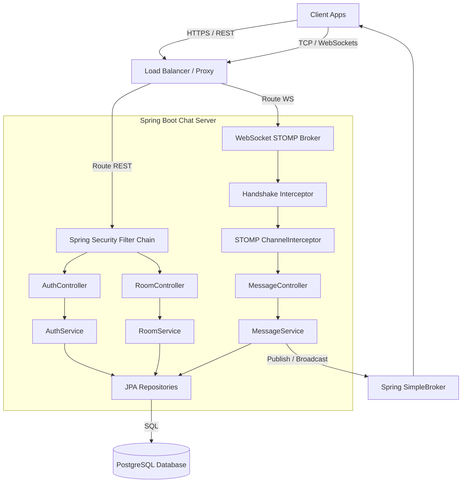

# System Architecture

This document outlines the overall architecture of the Real-Time Chat Platform, detailing components, service boundaries, and interactions.

---

## 1. System Overview

The platform uses a layered monolithic architecture built on Spring Boot, designed to easily decompose into isolated microservices.

---

## 2. Component Responsibilities

| Component | Responsibility |
| :--- | :--- |
| **Client Applications** | Handles user interface, saves JWT access tokens in memory, and negotiates STOMP connections. |
| **Load Balancer** | Handles HTTPS/TLS termination and routes HTTP REST or WebSocket TCP traffic to application nodes. |
| **Spring Security Filter Chain** | Authenticates incoming REST requests stateless using the Authorization header JWT. |
| **STOMP ChannelInterceptor** | Intercepts incoming WebSocket/STOMP packets. Performs authentication on `CONNECT` and verifies channel access on `SUBSCRIBE`/`SEND`. |
| **REST Controllers** | Deserializes payloads, validates schemas (JSR-380), and returns REST responses. |
| **WebSocket Controllers** | Receives real-time incoming messages, coordinates database persistence, and relays to the broker. |
| **Domain Services** | Coordinates transaction boundaries, executes business logic, and encodes credentials. |
| **Presence Service** | Manages online/offline user states in memory and coordinates real-time status broadcasts. |
| **PostgreSQL Database** | Persistent storage for user records, room details, membership lists, and conversation logs. |

---

## 3. Service Interactions

### 1. Registration & Authentication (REST)
- User signs up/in via `AuthController`. If successful, the server issues a database-backed Refresh Token and a JWT.

### 2. Room Configuration (REST)
- Users call `RoomController` to create rooms, join rooms, or initiate direct messages (DMs) with other users. These write operations are transactionally persisted to SQL. DMs are registered as a distinct room type.

### 3. Real-Time Message Exchange (WebSockets + STOMP)
- Clients upgrade their connection to raw WebSockets on endpoint `/ws`.
- The connection is validated by checking the JWT in the STOMP header.
- When sending a message to `/app/chat.sendMessage`, the server persists the message payload to the database asynchronously or synchronously, then publishes the message to the corresponding `/topic/room.{roomId}` broker channel, notifying all active subscribers.

### 4. User Presence Tracking (Spring Events + STOMP Broadcast)
- When a user establishes a STOMP connection, Spring publishes a `SessionConnectEvent`.
- A presence listener catches this event, registers the user as online in `PresenceService`, and broadcasts a presence status event (`ONLINE`) to `/topic/presence.{roomId}` for all rooms the user belongs to.
- When the socket connection terminates, a `SessionDisconnectEvent` fires, marking the user as `OFFLINE` and broadcasting the status change.

### 5. Real-Time Typing Indicators (Transient WebSocket Event)
- When a user starts typing, the client publishes a STOMP frame to `/app/chat.typing`.
- The interceptor verifies room membership to block unauthorized alerts.
- The server bypasses database persistence entirely, immediately routing the typing notification payload as a broadcast to `/topic/typing.{roomId}`.
- All active room subscribers receive the payload and render the indicator.

### 6. Message Read Receipts (WebSocket Event + SQL persistence)
- When a user reads messages in a room, the client publishes a STOMP frame to `/app/chat.readReceipt` indicating their last read message ID.
- The interceptor verifies room membership.
- The server updates `last_read_message_id` on the user's `RoomMember` record in PostgreSQL.
- The server broadcasts the receipt update to `/topic/receipts.{roomId}` to inform other members of their updated read pointer.
