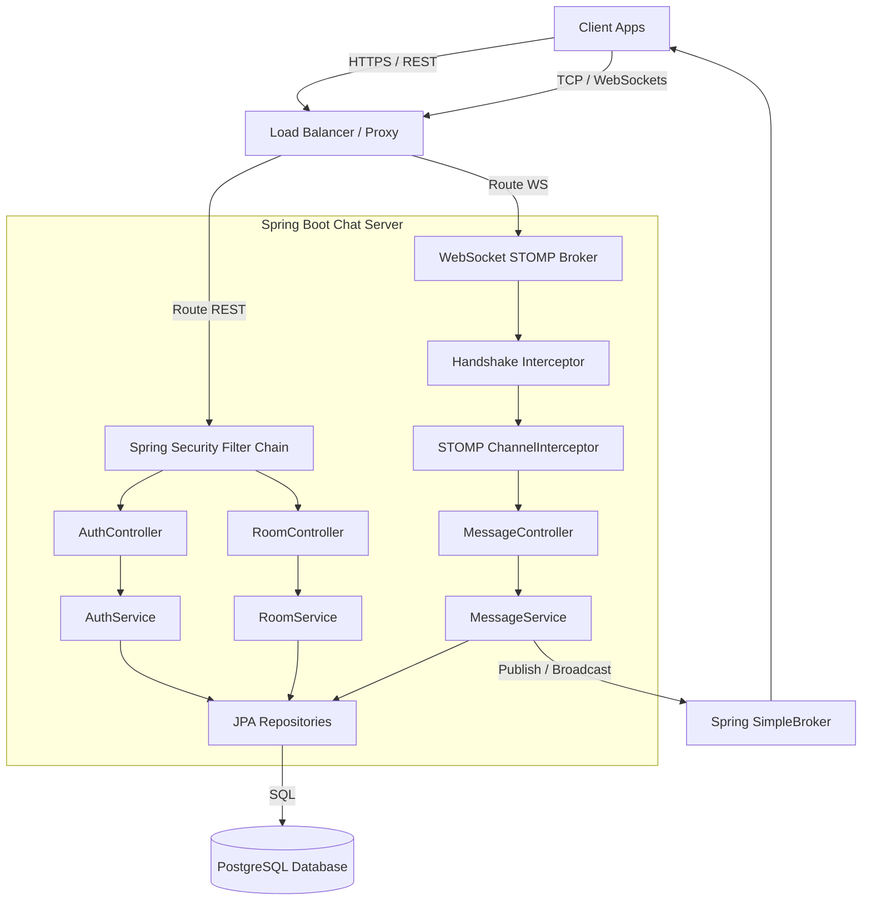

# System Architecture

This document outlines the overall architecture of the Real-Time Chat Platform, detailing components, service boundaries, and interactions.

---

## 1. System Overview

The platform uses a layered monolithic architecture built on Spring Boot, designed to easily decompose into isolated microservices.

---

## 2. Component Responsibilities

| Component | Responsibility |
| :--- | :--- |
| **Client Applications** | Handles user interface, saves JWT access tokens in memory, and negotiates STOMP connections. |
| **Load Balancer** | Handles HTTPS/TLS termination and routes HTTP REST or WebSocket TCP traffic to application nodes. |
| **Spring Security Filter Chain** | Authenticates incoming REST requests stateless using the Authorization header JWT. |
| **STOMP ChannelInterceptor** | Intercepts incoming WebSocket/STOMP packets. Performs authentication on `CONNECT` and verifies channel access on `SUBSCRIBE`/`SEND`. |
| **REST Controllers** | Deserializes payloads, validates schemas (JSR-380), and returns REST responses. |
| **WebSocket Controllers** | Receives real-time incoming messages, coordinates database persistence, and relays to the broker. |
| **Domain Services** | Coordinates transaction boundaries, executes business logic, and encodes credentials. |
| **Presence Service** | Manages online/offline user states in memory and coordinates real-time status broadcasts. |
| **PostgreSQL Database** | Persistent storage for user records, room details, membership lists, and conversation logs. |

---

## 3. Service Interactions

### 1. Registration & Authentication (REST)
- User signs up/in via `AuthController`. If successful, the server issues a database-backed Refresh Token and a JWT.

### 2. Room Configuration (REST)
- Users call `RoomController` to create rooms, join rooms, or initiate direct messages (DMs) with other users. These write operations are transactionally persisted to SQL. DMs are registered as a distinct room type.

### 3. Real-Time Message Exchange (WebSockets + STOMP)
- Clients upgrade their connection to raw WebSockets on endpoint `/ws`.
- The connection is validated by checking the JWT in the STOMP header.
- When sending a message to `/app/chat.sendMessage`, the server persists the message payload to the database asynchronously or synchronously, then publishes the message to the corresponding `/topic/room.{roomId}` broker channel, notifying all active subscribers.

### 4. User Presence Tracking (Spring Events + STOMP Broadcast)
- When a user establishes a STOMP connection, Spring publishes a `SessionConnectEvent`.
- A presence listener catches this event, registers the user as online in `PresenceService`, and broadcasts a presence status event (`ONLINE`) to `/topic/presence.{roomId}` for all rooms the user belongs to.
- When the socket connection terminates, a `SessionDisconnectEvent` fires, marking the user as `OFFLINE` and broadcasting the status change.

### 5. Real-Time Typing Indicators (Transient WebSocket Event)
- When a user starts typing, the client publishes a STOMP frame to `/app/chat.typing`.
- The interceptor verifies room membership to block unauthorized alerts.
- The server bypasses database persistence entirely, immediately routing the typing notification payload as a broadcast to `/topic/typing.{roomId}`.
- All active room subscribers receive the payload and render the indicator.

### 6. Message Read Receipts (WebSocket Event + SQL persistence)
- When a user reads messages in a room, the client publishes a STOMP frame to `/app/chat.readReceipt` indicating their last read message ID.
- The interceptor verifies room membership.
- The server updates `last_read_message_id` on the user's `RoomMember` record in PostgreSQL.
- The server broadcasts the receipt update to `/topic/receipts.{roomId}` to inform other members of their updated read pointer.

### 7. Media & Attachment Handling (REST Upload + WebSocket Alert)
- Users upload media files (images, files) via `MediaController` using multipart forms.
- The server validates file types and sizes.
- The file is saved to the local file system (or object storage).
- The server returns the media URL and metadata.
- When the client sends the message via WebSocket, it includes the media URL, linking the attachment to the chat log.

### 8. Message Editing & Deletion (REST Trigger + WebSocket Sync)
- A user triggers a message update or deletion via REST endpoints (`PUT/DELETE /api/v1/messages/{messageId}`).
- The server validates ownership of the target message (caller must be the original sender).
- On edit: content is modified, and the `updatedAt` field is set.
- On delete: the message is soft-deleted by setting the `content = null` and raising an `is_deleted` flag, preserving relational receipts.
- The server broadcasts the update payload to `/topic/room.{roomId}`. Peer clients receive this frame and update their local message UI state in real-time.

### 9. Message Reactions (REST Toggle + WebSocket Sync)
- A user adds or removes a reaction (emoji) on a message via REST endpoint `POST /api/v1/messages/{messageId}/reactions`.
- The server validates that the user is a member of the room where the target message resides.
- The server adds/deletes a record in the `message_reactions` table using a toggle mechanism.
- The server issues a STOMP broadcast to `/topic/room.{roomId}` containing the message ID and updated reaction count details. Peer clients sync their UI reaction indicators in real-time.

### 10. Message Search (REST Full-Text Search)
- A user submits a keyword search request to the REST endpoint `GET /api/v1/rooms/{roomId}/messages/search?query=keyword`.
- The server validates that the user is a member of the target room.
- The server queries the database using full-text search operators against the `content` field.
- Database index scans are executed via a GIN index on message content vector representations.
- The server returns a paginated list of matching message DTO responses.

### 11. User Mentions (@Mentions & Private Notification Syncing)
- When a message is sent, the server parses the content for `@username` patterns.
- For each detected username, the server verifies that the user exists and is a member of the room.
- Verified mentions are persisted in the `message_mentions` table.
- The server broadcasts private real-time notification alerts to each mentioned user via their secure user-specific queues `/user/queue/notifications`. Peer clients intercept this frame to trigger push updates or audio pings.

### 12. Message Pins (REST Toggle + WebSocket Sync)
- A user pins or unpins a message in a room via REST endpoint `POST /api/v1/messages/{messageId}/pin`.
- The server validates room membership, target message existence, and that the message has not been soft-deleted.
- Pin state changes are persisted in the `pinned_messages` table, housing pin metadata (who pinned it and when).
- The server issues a STOMP broadcast to `/topic/room.{roomId}` syncing the pin state change across all room members' screens.
- Room members can query all active pinned messages in a room via `GET /api/v1/rooms/{roomId}/pins` (fetching only from the `pinned_messages` join table for sub-millisecond retrieval).

### 13. Channel Roles & Moderation (REST Operations)
- Room membership is enriched with hierarchical roles: `OWNER`, `MODERATOR`, and `MEMBER`.
- On room creation, the creator is designated as the `OWNER`. Joining users are initialized as `MEMBER`s.
- `OWNER`s can promote other members to `MODERATOR`s or demote them via the role-change REST endpoint: `PUT /api/v1/rooms/{roomId}/members/{userId}/role`.
- `OWNER`s and `MODERATOR`s can kick channel participants via `DELETE /api/v1/rooms/{roomId}/members/{userId}` (moderators cannot demote/kick the owner).
- Moderation privileges are checked when deleting messages: standard `MEMBER`s can only delete *their own* messages, whereas `OWNER`s and `MODERATOR`s can delete *any* message in the channel.

### 14. Threaded Messaging & Replies (Parent-Child Message Routing)
- Messages can contain an optional `parent_message_id` reference, pointing to a parent message in the same room.
- Sending a message with a parent ID registers it as a reply, initiating a conversational thread.
- Thread replies are broadcast to the room topic `/topic/room.{roomId}` to ensure normal flow synchronization.
- Peer clients can fetch all replies under a specific thread tree using the REST endpoint `GET /api/v1/messages/{messageId}/thread` (efficient B-Tree index lookup on the self-referencing column).

### 15. Direct Messaging & 1-on-1 Conversations
- A Direct Message (DM) room represents a private 1-on-1 channel between exactly two users.
- DMs are initiated via `POST /api/v1/rooms/dm` providing the target user's ID.
- The system checks if a DM room already exists between the two users. If it does, the existing room is returned to prevent duplicate room creation.
- If not, a new room with type `DIRECT_MESSAGE` is created, and both participants are automatically enrolled as room members.
- Public directory lookups (`GET /api/v1/rooms`) exclude DM rooms to ensure privacy bounds. Clients access their active DM rooms through their joined rooms endpoint.

### 16. Message Edit History (Revision Logs)
- Message updates are tracked to maintain audit history of edited content.
- When an edit request is received via `PUT /api/v1/messages/{messageId}`, the existing content is copied into a `message_revisions` audit record before the message record is updated.
- Users can fetch the history of edits for a message using the REST endpoint `GET /api/v1/messages/{messageId}/history`.
- In-memory checks verify room membership of the requesting user, securing audit access against non-member access attempts.
- Cascading deletion rules are configured so that deleting a message automatically purges its associated audit revision logs.

### 17. Shared Redis Pub/Sub Message Broker (WebSocket Horizontal Scaling)
- Real-time messages are routed via a shared **Redis Pub/Sub** message broker channel to support horizontal clustering.
- When a node receives a WebSocket message on `/app/chat.sendMessage`, it processes the transaction, saves it to the database, and publishes the event to a shared Redis channel.
- All cluster nodes listen to this Redis channel. When they receive an event, they route the payload to any local clients subscribed to `/topic/room.{roomId}`.
- This ensures that users receive messages in real-time, even if they are connected to different application server instances.

### 18. Cloud Storage Upload Integration (AWS S3 Pre-signed URLs)
- Uploading large media files through Spring Boot application servers saturates network bandwidth and memory.
- S3 **Pre-signed PUT URLs** enable clients to upload files directly to Cloud Storage (AWS S3), bypassing backend instance bounds entirely.
- The client calls `POST /api/v1/media/pre-signed-url` providing file metadata. The server generates a pre-signed S3 upload URL.
- Local storage configurations act as fallbacks if S3 keys or credentials are not defined.
- Once the upload completes, S3 files are delivered via CloudFront CDN routes.

### 19. Private Channels & Invite Links
- Private rooms (`room_type = PRIVATE_GROUP`) are introduced. Unlike public groups, users cannot join them without a valid invite.
- Room owners or moderators can create single-use or multi-use time-limited invite links: `POST /api/v1/rooms/{roomId}/invites`.
- The system generates a secure, random invite code mapped to a target room, specifying an expiration time and usage limit.
- Users join private channels using `POST /api/v1/rooms/join-by-invite/{code}`.
- If the invite code is valid, has not expired, and has not exceeded its usage limit, the user is added to the room as a `MEMBER`.
- Usage count increments are handled using atomic database updates to prevent race conditions.
