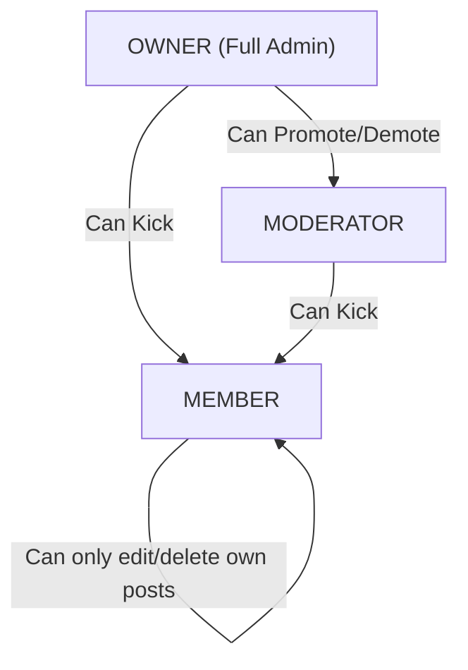

# Concepts Guide

This document explains key backend, security, and database concepts introduced during Feature 1 and Feature 2 implementation.

---

## 1. WebSockets & STOMP Protocol (RFC 6455)

HTTP is unidirectional. WebSockets provide full-duplex communication over a single TCP connection.

### The Lifecycle
1.  **Handshake**: Client initiates an HTTP request with specific headers:
    - `Upgrade: websocket`
    - `Connection: Upgrade`
    - `Sec-WebSocket-Key: <base64>`
2.  **Upgrade**: The server responds with `HTTP/1.1 101 Switching Protocols`. The TCP socket remains open, allowing frames to flow bi-directionally without the overhead of HTTP headers.
3.  **STOMP Frame Protocol**: Over this raw connection, clients exchange STOMP frames:
    ```text
    SEND
    destination:/app/chat.sendMessage
    content-type:application/json

    {"roomId":"e3b0c442...","content":"Hello!"}^@
    ```
    - The frame consists of a Command, Headers (key-value), a blank line, a body payload, and a null character (`^@`).

---

## 2. Spring ChannelInterceptors
Spring WebSocket architecture uses message channels:
- `clientInboundChannel`: Receives messages from clients.
- `clientOutboundChannel`: Sends messages to clients.
- `brokerChannel`: Sends messages to the broker.

We can intercept these channels using a `ChannelInterceptor` (e.g., `preSend`):
- This allows us to intercept a STOMP `CONNECT` frame, extract the authorization header, validate the JWT, and authenticate the session before the request proceeds.
- We also intercept `SUBSCRIBE` frames to ensure the user is an active member of the target channel, preventing unauthorized access.

---

## 3. Database Indexes: B-Tree & Composite Indexing

Indexes speed up data retrieval at the cost of disk space and write overhead.

### 1. B-Tree Indexes
PostgreSQL uses B-Trees (Balanced Trees) by default. They keep data sorted and allow search, sequential access, insertions, and deletions in logarithmic time $O(\log n)$.
- We index `users(email)` and `users(username)` to ensure O(1)-like login and lookup checks.

### 2. Composite Indexes
A composite index covers multiple columns (e.g., `messages(room_id, created_at DESC)`).
- **Sorting Performance**: When querying message history for a room, we run:
  ```sql
  SELECT * FROM messages WHERE room_id = ? ORDER BY created_at DESC LIMIT 50;
  ```
  If we only index `room_id`, the database must fetch all messages for the room and sort them in memory.
  By creating a composite index on `(room_id, created_at DESC)`, the index stores the records pre-filtered and pre-sorted on disk. The database traverses the B-Tree directly to the matching node and reads the next 50 records sequentially.
- **Column Order**: The order of columns in a composite index is critical. The column used with equality operators (`room_id = ?`) must come first, followed by columns used for range queries or sorting (`created_at`).

---

## 4. Spring ApplicationEvent Multicaster & WebSocket Session Events

Spring provides an event-driven model using `ApplicationEvent` and `ApplicationListener`.
In a WebSocket application:
1.  **SessionConnectEvent**: Published when a new STOMP client sends a CONNECT frame. Spring upgrades the session and maps the user's principal attributes.
2.  **SessionDisconnectEvent**: Published when a client session ends (due to network timeout, socket termination, or browser tab closure).

By defining a listener class (`@Component` implementing or declaring `@EventListener`), we can intercept these lifecycle events to register online and offline transitions. These event listeners are executed on Spring's core message dispatcher thread pool.

---

## 5. Concurrent Collections: ConcurrentHashMap Thread-Safety

To track presence without database writes, we store active online sessions in memory.
- **Why not standard HashMap?**: `HashMap` is not thread-safe. Concurrent modifications (multiple threads reading and writing connections simultaneously) can corrupt internal hash buckets, resulting in infinite loops, CPU spikes, or `ConcurrentModificationException` failures.
- **ConcurrentHashMap**: Uses segmented locks (or CAS - Compare-And-Swap operations on bucket heads in modern Java) to allow concurrent readers and writers to access different hash bins without blocking each other. This provides high concurrency reads and writes at $O(1)$ complexity.

---

## 6. SQL Relational Intersection Queries (Finding DM Rooms)

When User A wants to start a Direct Message (DM) chat with User B, the backend must verify if a DM room already exists between them.
Because room memberships are modeled as rows in a join table (`room_members`), this query represents a **relational intersection problem** (finding the room ID where both users are members, and the room type is `DIRECT_MESSAGE`).

In SQL, this is optimized using a **self-join** on the membership table, checking that both rows map to the same room:
```sql
SELECT rm1.room_id 
FROM room_members rm1
JOIN room_members rm2 ON rm1.room_id = rm2.room_id
JOIN rooms r ON r.id = rm1.room_id
WHERE r.room_type = 'DIRECT_MESSAGE'
  AND rm1.user_id = :userA
  AND rm2.user_id = :userB;
```

### Execution Strategy
1.  **Index Traversal**: The database engine performs a B-Tree index lookup for `rm1.user_id = :userA` using the secondary index `idx_room_members_user`.
2.  **Join Constraints**: For each room matching User A, it performs a nested-loop index lookup on the composite primary key `(room_id, user_id)` of `rm2` checking for `user_id = :userB`.
3.  **Type Check**: It joins the corresponding row in `rooms` to verify that `room_type = 'DIRECT_MESSAGE'`.
This executes in $O(\log N)$ logarithmic time, bypassing full table scans.

---

## 7. Client-Side Rate-Limiting: Throttling & Debouncing

High-frequency real-time actions (like user typing notifications or window resizes) can quickly overwhelm network buffers. To prevent flooding, systems implement rate-limiting strategies:

1.  **Throttling**: Enforces a maximum execution frequency. If a function is throttled to 3 seconds, it executes immediately on the first call, but subsequent calls within that 3-second window are discarded or delayed.
    - *Usage*: Typing indicator heartbeats. Once a user starts typing, the server is notified. Subsequent keystrokes are throttled; the client only sends a ping every 3 seconds to confirm they are still active.
2.  **Debouncing**: Delays execution until a specified period of inactivity has elapsed. If the function is debounced to 1 second, it will not fire until 1 second after the user has completely stopped calling it.
    - *Usage*: Typing cancellation. When the user stops typing, the client debounces for 3 seconds before sending the `typing = false` frame to inform peers they have stopped.

---

## 8. Read Receipts Storage Optimization (Reducing Write Amplification)

In high-concurrency chat systems, tracking which messages have been read by which users can generate enormous write amplification:
- **Naive Approach**: Create a row in a `message_receipts` table for *every message* for *every user*. In a room with 100 members, sending a single message generates 100 database writes as members open the room and read it. At scale, this quickly saturates the transaction pool.
- **Optimized Approach (Read Pointer)**: Since messages in a room are ordered sequentially by creation time (or auto-incrementing sequences), we only need to track the **last read message ID** (or timestamp) per user per room.
  - We store this in the `room_members` table as `last_read_message_id`.
  - When a user reads the latest message, we update their single member record.
  - This collapses hundreds of individual row inserts into a single SQL `UPDATE` statement per user session.
  - To find if a specific message has been read by User X, we check if the message's creation date/ID is less than or equal to User X's last read message. This reduces database write loads by orders of magnitude.

---

## 9. Media Attachment Handling & Storage Integration

Modern real-time systems handle file and media attachments securely using decoupled upload pipelines:

1.  **Multipart File Ingestion**: Files are uploaded via REST (`multipart/form-data`) as `MultipartFile` streams.
2.  **Mime-Type Auditing (Magic Numbers)**: Verifying file extensions (e.g. checking `.jpg`) is vulnerable to spoofing. Attackers can rename executable scripts (`shell.sh`) to images (`shell.jpg`) to bypass filters.
    - *Mitigation*: The backend parses the **magic numbers** (first few bytes of the file stream) using Java's `Files.probeContentType()` or Apache Tika to determine the authentic content type before saving.
3.  **Local Storage vs Object Storage**:
    - **Local Block Storage**: Uploads are saved to the server's local file system (e.g., `/var/www/uploads`). It is simple to implement but has severe horizontal limitations (instances in a cluster do not share storage, and local disks are ephemeral).
    - **Cloud Object Storage (S3)**: Files are written directly to S3 or Google Cloud Storage. Gateways generate **Pre-signed URLs** allowing clients to upload directly to S3 buckets, bypassing the application server to eliminate bandwidth bottlenecks.
4.  **CDN Integration**: Attachment URLs reference a Content Delivery Network (e.g., CloudFront, Cloudflare) rather than raw S3 buckets, caching media at edge caches globally for sub-millisecond download times.

---

## 10. Soft-Deletion vs. Hard-Deletion Trade-offs & Row-Level Validation

### 1. Soft-Deletion vs. Hard-Deletion
When a user deletes a message, we must decide how to handle the data:
-   **Hard-Deletion**: Runs `DELETE FROM messages WHERE id = :id`.
    - *Pros*: Reclaims disk space instantly.
    - *Cons*: Destroys relational integrity. If other tables reference this message ID (such as `room_members.last_read_message_id`), foreign key checks fail or set fields to null. It also makes tracking compliance history impossible.
-   **Soft-Deletion**: Sets `is_deleted = TRUE` and nullifies content/attachments.
    - *Pros*: Relational database references remain intact. Chat histories display "This message was deleted" cleanly without breaking sequential pagination indices.
    - *Cons*: Retains rows in database indexes (though index sizes are negligible for soft-deleted flags).

### 2. Row-Level Ownership Validation
To prevent unauthorized users from editing or deleting peer messages, the service enforces row-level ownership:
1.  Query target message entity.
2.  Compare message sender ID against caller's authenticated user ID.
3.  If they do not match, throw `AccessDeniedException` (caught by the handler, returning `403 Forbidden`).
4.  Only execute transaction updates if validation succeeds.

---

## 11. Emoji Validation & Batch Query Aggregations

Adding support for emoji reactions introduces several backend performance and input validation design challenges:

### 1. Emoji Validation
Validation of emojis must be robust. If users can react with arbitrary strings, they can execute SQL injections, inject JavaScript, or spam with long strings.
-   *Mitigation*: Enforce a strict regex boundary. Valid emojis are matched against the standard Unicode Emoji Regex or Unicode character code sequences. Length is constrained to a maximum of 32 characters (supporting complex composite emojis with zero-width joiners like 🧑‍💻).

### 2. Query Aggregation: Resolving the N+1 Query Problem
When clients retrieve the message history of a room (e.g. 50 messages), the server must return the reactions associated with each message:
-   **N+1 Query (Problem)**: Querying reactions independently for each message forces 1 query for history and 50 additional queries to fetch reactions. At scale, this quickly saturates the database connection pool.
-   **Eager Fetch Join (Problem)**: Using `@OneToMany(fetch = FetchType.EAGER)` creates cartesian product row expansions if a message contains multiple attachments AND reactions, creating duplicates and high network overhead.
-   **Centralized Batch Querying (Solution)**: Fetch the 50 messages first. Collect their IDs. Perform a single batch query to retrieve all reactions:
    `SELECT r FROM MessageReaction r WHERE r.message.id IN (:messageIds)`
    Group the results by message ID in memory using a Java `Map<UUID, List<MessageReaction>>` before transforming them to DTOs. This reduces the database round-trips to exactly **two queries** regardless of the page size, achieving $O(1)$ query aggregation scalability.

---

## 12. Full-Text Search Indexing & Postgres GIN (Generalized Inverted Index)

In messaging systems, keyword search is a high-frequency operation. Implementing search efficiently requires specialized indexing strategies:

### 1. The Cost of `LIKE` Queries
Using SQL queries like `SELECT * FROM messages WHERE content LIKE '%keyword%'` triggers a **Full Table Scan**. The database must inspect every character of every row sequentially. As chat message logs reach millions of rows, search latency balloons, leading to slow page loads and high CPU load.

### 2. Full-Text Search (FTS) in PostgreSQL
PostgreSQL provides native Full-Text Search using two constructs:
-   `tsvector`: Converts text into a list of lexemes (root words, stripping suffixes like "ing" or "ed" and common stop words like "the" or "and").
-   `tsquery`: Parses search queries into lexemes linked by logical operators (AND, OR, NOT).

### 3. GIN (Generalized Inverted Index)
To make full-text search queries execute in sub-milliseconds, PostgreSQL uses **GIN Indexes**. Unlike B-Tree indexes which map a column value to a row, a GIN Index maps a single lexeme/word to a list of matching row locations where that word appears.
-   *Syntax*: `CREATE INDEX idx_messages_content_fts ON messages USING gin(to_tsvector('english', content));`
-   *Execution*: When a user searches for a term, PostgreSQL parses the query into a `tsquery` and scans the GIN index structure, returning matching primary key locations in logarithmic $O(\log N)$ time.

### 4. Elasticsearch/OpenSearch Offloading (Scaling Pattern)
For extremely high-scale applications, GIN write penalties (GIN indexes are slower to update during inserts because multiple lexemes must be inserted into the index for a single message) prompt organizations to move search out of the relational database:
1.  Enable **Change Data Capture (CDC)** (e.g. Debezium) on the `messages` table.
2.  Stream insert events to a Kafka topic.
3.  Ingest logs into **Elasticsearch**.
4.  Clients route search requests to Elasticsearch, offloading search queries entirely from the primary relational database.

---

## 13. User Mentions & Private Socket Notifications

Mentions provide real-time user notification hooks. Designing mentions requires resolving parser strategies and notification security:

### 1. Mentions Parsing: Server-side Regex vs Client-side Arrays
When a user sends a message containing `@username`, we must extract the username target:
-   **Client-Side Array Injection**: The client parses the text, resolves user IDs, and submits them as an explicit array property in the request payload.
    - *Cons*: High security risk. A malicious client could manipulate the IDs array to notify users who are not mentioned in the text body, or bypass validation checks entirely.
-   **Server-Side Regex Extraction [Chosen]**: The server acts as the source of truth, scanning the text using a strict regex: `(?<=^|(?<=\s))@([a-zA-Z0-9_]{3,30})`.
    - *Pros*: Completely secure. Ensures only users explicitly typed in the text can be registered as mentioned.

### 2. Room Membership Validations
Mentions can leak channel existence. If a user in private Room A mentions a user who is not a member of Room A, does the target user get a notification?
-   *Mitigation*: The backend must validate that the mentioned user exists **and** is a joined member of the target channel room before persisting the mention or issuing notifications, preventing private channel leak vectors.

### 3. Private WebSocket Notification Routing
Standard room updates are broadcast to public channel topics `/topic/room.{roomId}` subscribers. Mentions, however, require private delivery to the targeted user:
-   **Spring Security Destination Mapping**: We use Spring's `messagingTemplate.convertAndSendToUser(username, "/queue/notifications", payload)` which transparently prefix-maps the route to `/user/{username}/queue/notifications`.
-   This ensures only the authenticated target user can subscribe to or receive their notifications stream.

---

## 14. Message Pinning Audit Mappings (Boolean Flag vs Audit Table)

Pinning a message marks it as a key resource in a channel. Designing pinning state persistence involves trade-offs:

### 1. The Entity Persistence Trade-off
-   **Approach A: Field Flag (`messages.is_pinned`)**:
    - Add a boolean flag column directly to the `messages` table.
    - *Cons*: Fails to capture pin audit trail context (e.g. "Who pinned this message?", "When was it pinned?"). High index maintenance overhead when query scanning is pinned messages.
-   **Approach B: Standalone Audit Table (`pinned_messages`) [Chosen]**:
    - Create a distinct join entity: `id`, `message_id`, `room_id`, `pinned_by_user_id`, `created_at`.
    - *Pros*: Complete audit trails, lightweight tables, sub-millisecond query execution on room indexes, clean database normalization.

### 2. Transaction Integrity & Constraints
- To prevent duplicate pin mappings, a composite unique index is placed on `(room_id, message_id)`.
- When a message is soft-deleted, any associated pin records in `pinned_messages` should be deleted automatically. We enforce this using database-level `ON DELETE CASCADE` foreign keys.

### 3. Room Moderation Security
- In general messaging architectures, pins can either be open to all channel members or restricted to administrators.
- *Implementation choice*: For public group messaging simplicity, we validate room membership checks: only users who have joined the channel room are authorized to pin or unpin room messages.

---

## 15. Channel Roles & Hierarchical Moderation (RBAC)

When scaling group messaging channels, moderation privileges must be enforced to protect users from spam and maintain community boundaries. Rather than complex runtime role permission tables, we implement a static Bounded Context Role hierarchy:



### 1. Hierarchical Kick Restrictions
To prevent privilege escalation attacks:
- `OWNER` can promote/demote or kick anyone.
- `MODERATOR` can kick standard `MEMBER`s.
- `MODERATOR` CANNOT kick or change the role of the `OWNER`.
- Standard `MEMBER`s cannot kick anyone.

### 2. Cascading Moderation Deletion
Standard API validations restrict message deletions to the author (`message.sender_id == current_user_id`). With role-based moderation:
- When a user requests message deletion, the backend fetches their `RoomMember` association.
- If the member holds the `OWNER` or `MODERATOR` role in that room, the sender validation check is bypassed, allowing moderators to immediately soft-delete spam.
- Standard members are still strictly bound to deleting only their own messages.

---

## 16. Threaded Conversations & Self-Referential Relational Models

Threaded messaging maps parent-child structures within the same database entity table. Designing replies involves managing recursive references, indexing parent IDs, and handling cascade deletions.

### 1. Database Mapping & Foreign Key
A message becomes a reply by linking its `parent_message_id` to `messages(id)`. This self-referencing column uses:
- A B-Tree index `idx_messages_parent` to quickly locate all replies for a given message ID ($O(\log N)$).
- A database-level `ON DELETE CASCADE` constraint. If a parent message is permanently deleted, all of its replies are deleted from the database in a single operation, maintaining relational integrity.

### 2. JPA Self-Referencing Annotations
In Hibernate/JPA:
- The parent message is mapped as:
  ```java
  @ManyToOne(fetch = FetchType.LAZY)
  @JoinColumn(name = "parent_message_id")
  private Message parentMessage;
  ```
- The child replies are mapped as:
  ```java
  @OneToMany(mappedBy = "parentMessage", cascade = CascadeType.ALL, orphanRemoval = true)
  private List<Message> replies = new ArrayList<>();
  ```
This structure ensures that Hibernate handles dirty-checking and state updates correctly, without requiring separate database operations.

### 3. Thread Scope & Room Bounds Validation
To prevent cross-room threading vulnerabilities (e.g., posting a reply in Room A that links to a parent message in Room B):
- When a user replies to a message, the backend validates that both the parent message and the reply belong to the exact same `room_id`.
- If the parent message is soft-deleted, replies are still allowed (enabling users to see thread history even if the parent content is removed). If the parent message is permanently deleted, the database deletes the child replies automatically.

---

## 17. Direct Message Conversations & Dynamic Membership Routing

Direct messaging is designed to establish private 1-on-1 channels between users. This requires unique identifier generation, auto-joining on room creation, and query isolation.

### 1. Uniqueness Guarantee Without Lock Contention
To prevent duplicate DM channels between User A and User B (which could result in split chat histories), we enforce a deterministic room naming formula:
1.  Extract the two participating User IDs (UUIDs).
2.  Sort them lexicographically so that `ID_A` is always less than `ID_B`.
3.  Concatenate them as `ID_A + ":" + ID_B`.
4.  Generate the MD5 hash of this string (resulting in a 32-character hex string).
5.  Set the room name to `dm-{MD5}` (exactly 35 characters).

Because the `rooms.name` column has a database-level `UNIQUE` constraint, concurrent creation requests automatically fail cleanly at the database level.

### 2. Transactional Auto-Enrollment
When a new DM room is created:
- The system must automatically register both the creator and the recipient as `RoomMember` records inside the same transactional boundary.
- Both participants are granted the `MEMBER` role to ensure symmetric access control.
- Because room membership is checked on WebSocket subscriptions and REST requests, this auto-enrollment grants both users instant real-time access.

### 3. Directory Listing & Isolation Bounds
Unlike public group channels, private DM channels must not be visible to third parties. We enforce this through Query Isolation:
- `roomRepository.findByRoomType(RoomType.PUBLIC_GROUP)` lists rooms for the public directory.
- Joined rooms are retrieved by querying the membership table: `roomMemberRepository.findRoomsJoinedByUser(userId)`. This naturally returns both public channels and private DMs the user is enrolled in, without leaking private DM channels.

---

## 18. Message Auditing & Revision Logs (Immutable Edit Tracking)

In compliance-heavy enterprise messaging systems, updating message records directly deletes historical context. Auditing requires recording immutable snapshots of message states prior to edits.

### 1. Revision Creation Trigger Flow
When a user edits a message:
- The service starts a read-write database transaction.
- It fetches the current state of the message.
- A new `MessageRevision` is created, archiving the current content (`oldContent = message.content`) and the timestamp (`editedAt = Instant.now()`).
- The message record is then updated with the new content, and the transaction is committed.

### 2. Retrieval Security Gating
Because revisions contain historical room messages, they are subject to the same access controls as the room itself:
- When fetching edit history for a message, the system resolves the parent message and checks the user's room membership.
- If the user is not a member of the room, access is blocked.

### 3. Relational Database Cleanups (Cascades)
Soft-deleting a message retains the message record, meaning revision logs remain accessible.
If a message is permanently deleted:
- The database engine uses a foreign key constraint with `ON DELETE CASCADE` on `message_revisions.message_id` to automatically delete all related revision logs.
- This prevents orphaned records and keeps the database clean.

---

## 19. Distributed WebSocket Event Relays & Pub/Sub Brokers

Scaling stateful protocols like WebSockets horizontally requires synchronizing event broadcasts across independent server nodes.

```mermaid
sequence-diagram
    User A -> Gateway Node 1: WebSocket Send Frame
    Gateway Node 1 -> Database: Save Message (Transaction)
    Gateway Node 1 -> Redis Pub/Sub: Publish event payload
    Redis Pub/Sub -> Gateway Node 2: Broadcast Event Relay
    Gateway Node 2 -> User B: Forward WebSocket Frame (Relay)
```

### 1. Stateful Sockets vs Stateless Scaling
WebSockets maintain a long-lived TCP connection to a single instance. In a clustered environment (e.g., behind an AWS Application Load Balancer), a client is pinned to one instance.
*   If User A is on `Node 1` and User B is on `Node 2`, Node 1 cannot send messages to User B directly.
*   *Solution*: Interconnect nodes using a shared message broker.

### 2. Redis Pub/Sub Architecture
Redis Pub/Sub allows nodes to publish messages to a channel and subscribe to receive them.
- When an instance receives a new chat message, it processes and saves it, then publishes the JSON payload to the shared Redis channel (`chat-events`).
- Every cluster node subscribes to `chat-events` on startup.
- When an instance receives an event from Redis, it checks if it has active WebSocket subscribers for that room. If so, it forwards the message to those clients.

### 3. Serialization and Deserialization Protocol
Since Redis channels handle raw bytes or strings, we serialize DTO objects (like `MessageResponse`) to JSON before publishing. The receiving nodes deserialize the JSON back into Java objects before broadcasting them over the WebSocket connection. This ensures compatibility across instances.

---

## 20. Direct-to-Cloud Uploads & S3 Pre-signed Tokens

Standard file uploads process raw byte streams through application servers. For high-volume chats (e.g. sharing image/video files), this has negative performance impacts:
*   Saturates backend instance network capacity.
*   Exhausts application memory buffers.
*   Blocks the thread pools of stateless WebSocket servers.

### 1. Direct Upload Flow (Pre-signed PUT URLs)
To avoid server saturation, we offload file uploads directly to AWS S3:
1.  **Request URL**: The client requests an upload link: `POST /api/v1/media/pre-signed-url` providing filename and content type.
2.  **Generate Pre-signed Token**: The server verifies authentication and uses the S3 SDK to generate a pre-signed PUT URL with a short expiration (e.g., 5 minutes).
3.  **Upload File**: The client uploads the file directly to S3 via HTTP PUT.
4.  **Confirm Upload**: Once the upload completes, the client includes the file key in the message payload. The server records the S3 resource URL in `message_attachments`.

### 2. High-Availability Fallback Strategy
If S3 configuration credentials (bucket name, region, or access keys) are missing or invalid:
- The server falls back to returning a local storage upload URL path.
- The client detects this and uploads to the backend local file server. This keeps the application functional during misconfigurations or cloud service outages.

---

## 21. Private Room Invites & Atomic Usage Tracking

Private channels (`RoomType.PRIVATE_GROUP`) restrict member access. Instead of listing rooms publicly, access is controlled using invite codes.

### 1. Cryptographically Secure Invite Codes
Invite links rely on short, random tokens (e.g. alphanumeric strings like `x8aB9fGh`) to identify the target room.
*   Codes are generated using a cryptographically secure random number generator (`SecureRandom`) to prevent brute-force attacks.
*   Each invite is mapped to a specific room ID, owner ID, expiration date, and usage limit.

### 2. Concurrency Safety & Atomic Usage Increments
When multiple users join a private room simultaneously using the same invite link:
- A naive check-then-act flow can lead to race conditions where the usage limit is exceeded:
  ```
  User 1 -> Check uses < max_uses (true) -------------------> Increment uses -> Save
  User 2 -------> Check uses < max_uses (true) -> Increment uses -> Save
  ```
- **Solution**: We use Spring Data JPA `@Modifying` queries with atomic updates to increment the usage count directly in the database:
  ```sql
  UPDATE room_invites SET uses = uses + 1 WHERE id = :id AND (max_uses IS NULL OR uses < max_uses);
  ```
  If the update returns `0` affected rows, it means the usage limit has been exceeded, and we reject the join request.

### 3. Expiration Gates
Each invite is validated against `Instant.now()`. If `expires_at` is set and has passed, the join request is rejected. Orphaning invites is prevented by using cascade deletes on the parent room.
