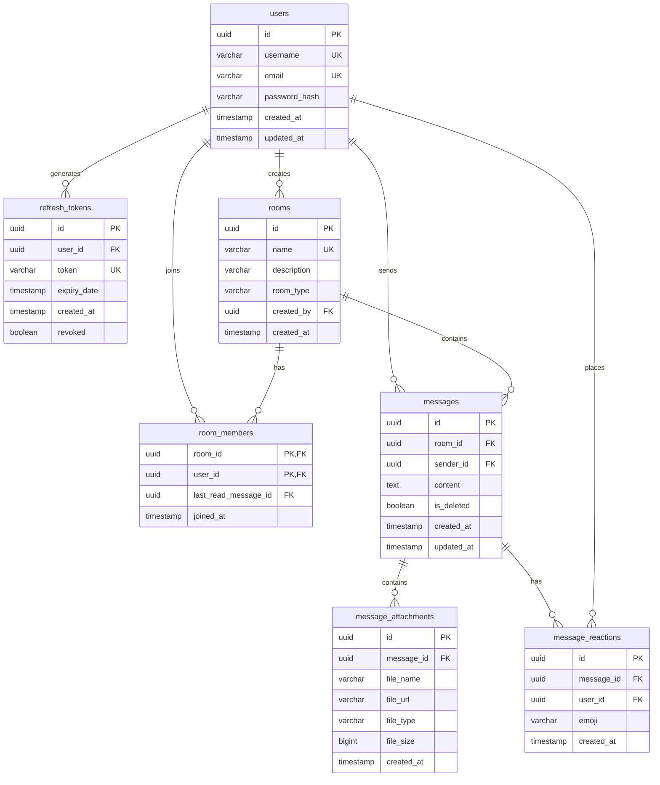

# Database Design

This document details schema definitions, relational constraints, indexing strategies, transactions, and locking models for the Chat Platform.

---

## 1. Schema Diagram (ERD)

---

## 2. Table Specifications & Indexes

### Table: `rooms`
- **Primary Key**: `id` (UUIDv4)
- **Foreign Key**: `created_by` referencing `users(id)`
- **Columns**:
  - `name` (VARCHAR(50), UNIQUE, NOT NULL)
  - `room_type` (VARCHAR(20), NOT NULL, default 'PUBLIC_GROUP'). Contains: 'PUBLIC_GROUP' or 'DIRECT_MESSAGE'.
- **Indexes**:
  - `idx_rooms_name` on column `name` (B-Tree). Optimized for checking existence during creation.

### Table: `room_members`
- **Primary Key**: Composite `(room_id, user_id)` (ensures a user cannot join the same room multiple times).
- **Foreign Keys**:
  - `room_id` references `rooms(id)` with `ON DELETE CASCADE`.
  - `user_id` references `users(id)` with `ON DELETE CASCADE`.
  - `last_read_message_id` references `messages(id)` with `ON DELETE SET NULL`.
- **Indexes**:
  - `idx_room_members_user` on column `user_id` (B-Tree). Optimized for checking which rooms a user has joined.

### Table: `messages`
- **Primary Key**: `id` (UUIDv4)
- **Foreign Keys**:
  - `room_id` references `rooms(id)` with `ON DELETE CASCADE`.
  - `sender_id` references `users(id)` with `ON DELETE SET NULL` (preserves historical messages when a user account is deleted).
- **Columns**:
  - `content` (TEXT, NULLABLE)
  - `is_deleted` (BOOLEAN, NOT NULL, DEFAULT FALSE)
  - `created_at` (TIMESTAMP, NOT NULL)
  - `updated_at` (TIMESTAMP, NULLABLE)
- **Indexes**:
  - **Composite Index**: `idx_messages_room_created` on columns `(room_id, created_at DESC)`. This is optimized for paginated message retrieval (ordering by newest first within a room), eliminating the need for database sorting on large datasets.
  - **Full-Text GIN Index**: `idx_messages_content_fts` on column `to_tsvector('english', content)`. Optimized for keyword searches, bypassing expensive table scans.

### Table: `message_attachments`
- **Primary Key**: `id` (UUIDv4)
- **Foreign Keys**:
  - `message_id` references `messages(id)` with `ON DELETE CASCADE`.
- **Columns**:
  - `file_name` (VARCHAR(255), NOT NULL)
  - `file_url` (VARCHAR(512), NOT NULL)
  - `file_type` (VARCHAR(100), NOT NULL)
  - `file_size` (BIGINT, NOT NULL)
- **Indexes**:
  - `idx_attachments_message` on column `message_id` (B-Tree). Optimized for retrieving attachments associated with messages.

### Table: `message_reactions`
- **Primary Key**: `id` (UUIDv4)
- **Foreign Keys**:
  - `message_id` references `messages(id)` with `ON DELETE CASCADE`.
  - `user_id` references `users(id)` with `ON DELETE CASCADE`.
- **Columns**:
  - `emoji` (VARCHAR(32), NOT NULL)
  - `created_at` (TIMESTAMP, NOT NULL)
- **Constraints**:
  - **Unique Index**: `unique_message_user_emoji` on columns `(message_id, user_id, emoji)` (prevents a user from reacting with the same emoji multiple times on a single message).
- **Indexes**:
  - `idx_reactions_message` on column `message_id` (B-Tree). Optimized for loading reactions during message history fetches.

---

## 3. Transactions & Locking Strategy

1.  **Read Committed Isolation**:
    - Queries see only committed transactions. Ideal for high-concurrency systems, preventing dirty reads.
2.  **Room Joining Concurrency**:
    - Simultaneous attempts by a user to join a room acquire a shared read lock on the user and room tables, and attempt an `INSERT` into `room_members`. The composite primary key enforces uniqueness, returning a constraint violation if duplicate requests occur.
3.  **Hibernate Session Performance**:
    - We use `@Transactional(readOnly = true)` for read-only actions (like fetching message lists or checking memberships). This disables Hibernate's automatic dirty checking of loaded entities, reducing CPU overhead and connection hold times.
