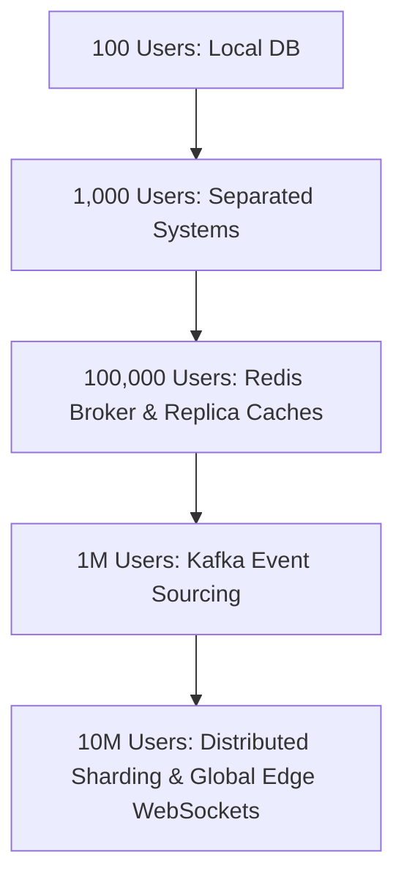

# Future Scalability Roadmaps

This document maps out scalability milestones as active traffic scales to millions of concurrent sessions.

---

## Scaling Milestones & Target Actions

### 1. Milestone: 100 Users
- Simple modular build. Database writes are synchronous. In-memory `SimpleBroker` handles real-time subscriptions.

### 2. Milestone: 1,000 Users
- PostgreSQL database moves to a managed instance (e.g. AWS RDS). Enable Flyway database migrations.

### 3. Milestone: 100,000 Users
- Deploy multiple backend instances behind a load balancer (AWS ALB).
- **Actions**:
  - **Shared Message Broker**: Replace SimpleBroker with a shared **Redis Pub/Sub** or **RabbitMQ** relay to route messages across cluster instances.
  - **Read-Write Separation**: Direct historical message queries (`GET /messages`) to PostgreSQL read-only replicas.
  - Cache user memberships in Redis to keep the `ChannelInterceptor` check extremely fast.

### 4. Milestone: 1 Million Users
- **Actions**:
  - **Asynchronous Message Persistence**: Decouple message delivery from database writes. When a client sends a message, broadcast it to online subscribers instantly, and publish the message payload to a Kafka topic. A consumer service reads from the topic and writes to PostgreSQL in batches, preventing database connection pool exhaustion.
  - Migrate message history storage to a NoSQL database (e.g., Cassandra / DynamoDB) designed to scale writes linearly.
  - Transition WebSocket connections to a lightweight, reactive Netty gateway (e.g., Spring WebFlux).

### 5. Milestone: 10 Million Users
- **Actions**:
  - Deploy geo-distributed WebSocket clusters at the edge close to users.
  - Use global load balancers and a multi-region active-active database (e.g., Spanner / Aurora Global Database) to replicate message logs across regions.
