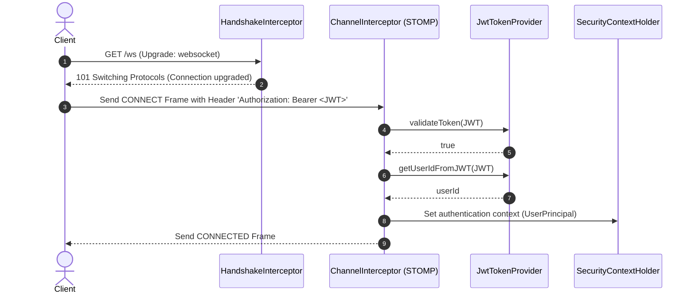
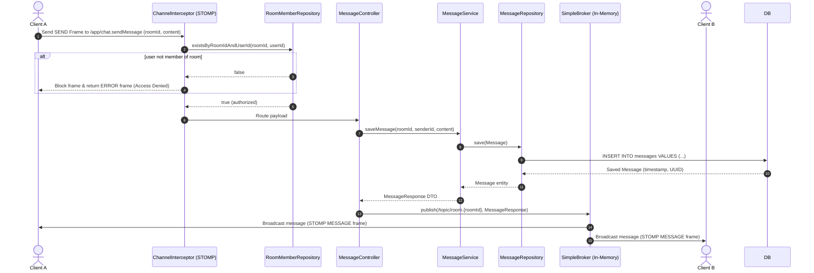

# Sequence Diagrams

This document contains sequence diagrams mapping client-server interactions for both REST and real-time WebSocket messaging lifecycles.

---

## 1. Create Room & Auto-Join (`POST /rooms`)

```mermaid
sequenceDiagram
    autonumber
    actor Client
    participant Controller as RoomController
    participant Service as RoomService
    participant Repo as RoomRepository
    participant MemberRepo as RoomMemberRepository
    database DB as PostgreSQL

    Client->>Controller: POST /rooms (name, description)
    Note over Controller: Spring Security extracts UserPrincipal from JWT
    Controller->>Service: createRoom(RoomCreateRequest, UserPrincipal)
    Service->>Repo: existsByName(name)
    Repo-->>Service: false (available)
    Service->>Repo: save(Room)
    Repo->>DB: INSERT INTO rooms VALUES (...)
    DB-->>Repo: Saved Room
    Service->>MemberRepo: save(RoomMember)
    Note over MemberRepo: Enrolls creator into membership
    MemberRepo->>DB: INSERT INTO room_members VALUES (roomId, userId)
    DB-->>MemberRepo: Saved RoomMember
    Service-->>Controller: Room
    Controller-->>Client: 201 Created (RoomResponse)
```

---

## 2. WebSocket Connection Handshake & Authentication



---

## 3. Real-Time Message Send & Broadcast Lifecycle


