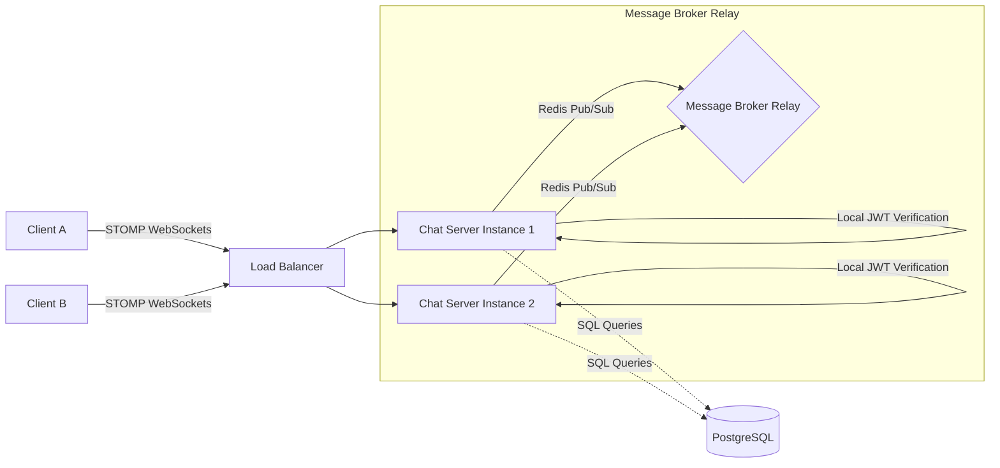

# System Design

This document details the scalability, bottlenecks, and engineering trade-offs of the Chat Platform.

---

## 1. Scalability Architecture

The system utilizes stateless JWT verification for standard API calls and leverages a decoupled pub/sub architecture for real-time messaging.

### Real-Time Scale Strategy
1.  **Stateless Handshake**: Checking bearer tokens during the STOMP connection is computed locally in memory on the gateway node, avoiding database access loops.
2.  **Horizontal Scale Broker**: Spring's default simple broker holds active sessions in local JVM memory. To support scaling to multiple application nodes, we deploy a **Redis Pub/Sub** or **RabbitMQ STOMP Relay** as a shared backing fabric. Messages sent to Instance A are relayed to Instance B via the message broker fabric, ensuring all connected clients receive broadcasts.

---

## 2. Architectural Trade-offs

### 1. SimpleBroker vs. RabbitMQ Relay
- **SimpleBroker (Chosen for initial modularity)**:
  - *Pros*: Runs in-memory, zero config, extremely fast.
  - *Cons*: Cannot route messages across multiple nodes (violates horizontal scale targets).
- **RabbitMQ STOMP Relay**:
  - *Pros*: Scalable, provides message guarantees, supports durable topics.
  - *Cons*: High deployment overhead, introduces operational cost and configuration loops.

### 2. Message Persistence Model: Synchronous vs. Asymmetric Async
- **Synchronous Write (Chosen for durability)**:
  - *Mechanism*: WebSocket controller receives message, writes to database, and broadcasts to broker only *after* database commit.
  - *Pros*: Guaranteed durability (clients never see messages that failed to save).
  - *Cons*: Latency is bound to DB transaction execution speeds (~10-25ms).
- **Asymmetric Async Write**:
  - *Mechanism*: Message is broadcast to subscribers instantly, and sent to an active queue (e.g. Kafka/RabbitMQ) to be persisted in the background.
  - *Pros*: Sub-1ms latency.
  - *Cons*: Risk of temporary inconsistencies (a message is displayed to a client but fails to write to DB).

### 3. Presence Storage Model: In-Memory vs. Database vs. Redis
- **In-Memory HashMap (Chosen for initial development)**:
  - *Pros*: Sub-microsecond latency, zero database overhead.
  - *Cons*: State lost on restarts; not shareable across cluster nodes (violates horizontal scalability).
- **PostgreSQL Database**:
  - *Pros*: Persistent, single source of truth shared by all instances.
  - *Cons*: Extreme disk I/O write amplification. Running SQL updates on every connection, disconnection, and heartbeat query would overwhelm database transaction pools.
- **Redis Cache (Target for scale)**:
  - *Pros*: In-memory speeds, globally shareable across nodes, built-in key TTLs perfect for dead-connection heartbeats.
  - *Cons*: Adds another operational infrastructure dependency.

---

## 3. Potential Bottlenecks & Mitigations

### 1. Database Connection Pool Starvation
- **Problem**: Writing message history at high frequency consumes SQL database connection pool locks.
- **Mitigation**: Implement batch database writing or migrate the messaging store to a wide-column NoSQL database (e.g., Cassandra / DynamoDB) which excels at handling high-volume writes.
- **Query Optimization**: Use composite index `(room_id, created_at DESC)` to keep historical queries extremely fast, minimizing connection hold times.

### 2. Active Socket Memory Footprint
- **Problem**: Holding 100k+ open TCP connections consumes server memory buffers (approx 10KB-100KB per connection depending on servlet settings).
- **Mitigation**: Adjust system TCP parameters (kernel buffer sizes) and use Netty or Spring WebFlux to transition from thread-per-request blocking I/O (Tomcat) to event-driven non-blocking I/O.

### 3. Presence Broadcast Storms
- **Problem**: When a user connects or disconnects, broadcasting the status event to all their rooms can trigger an exponential scale of outbound packets. If a user belongs to 50 rooms, each containing 1,000 active users, a single connect event triggers 50,000 outbound network packets.
- **Mitigation**: Implement throttling or change the client design to lazy query presence (request status only for users currently visible in the active chat viewport).

### 4. Typing Indicator Network Flooding
- **Problem**: Users type rapidly, generating keypresses at ~200ms intervals. If clients push a WebSocket event on every keystroke, the server connection buffers and inbound channels will be flooded with network frames, degrading performance for message processing.
- **Mitigation**: Implement **client-side debouncing and throttling**. The client sends a "typing = true" event *only* when typing begins, and throttles subsequent events (e.g. sending a ping once every 3 seconds to keep the state active). The client automatically stops the state with a "typing = false" event after 3 seconds of inactivity.
- **Bypass Database Persistence**: Typing notifications are highly transient. They must bypass PostgreSQL entirely and exist only as in-memory broadcast frames routed immediately to the broker, avoiding disk I/O saturation.
